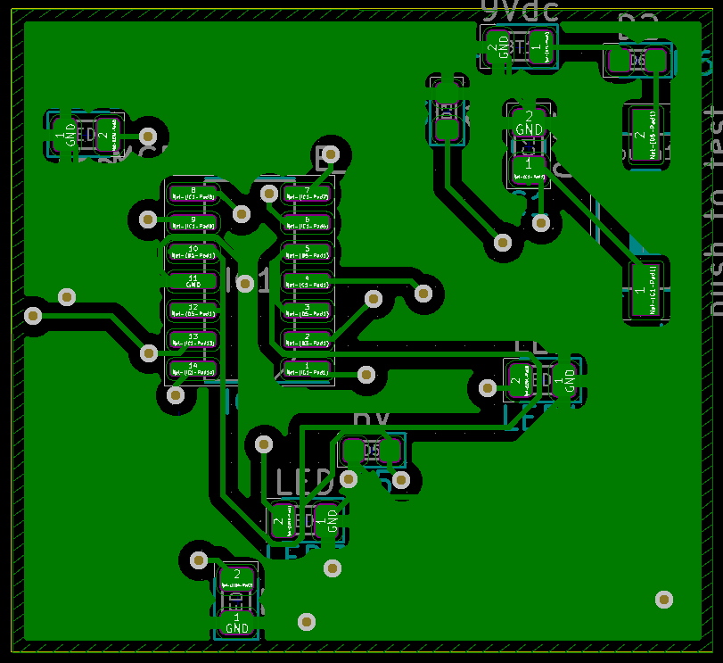
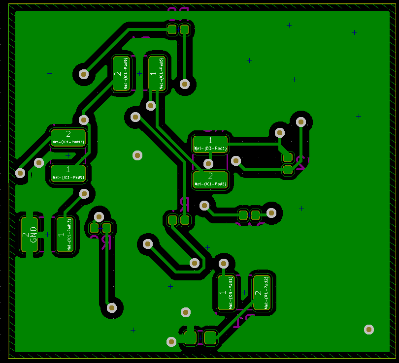
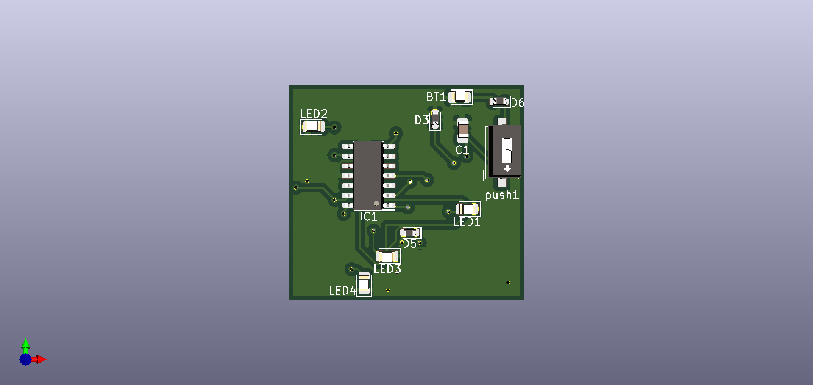
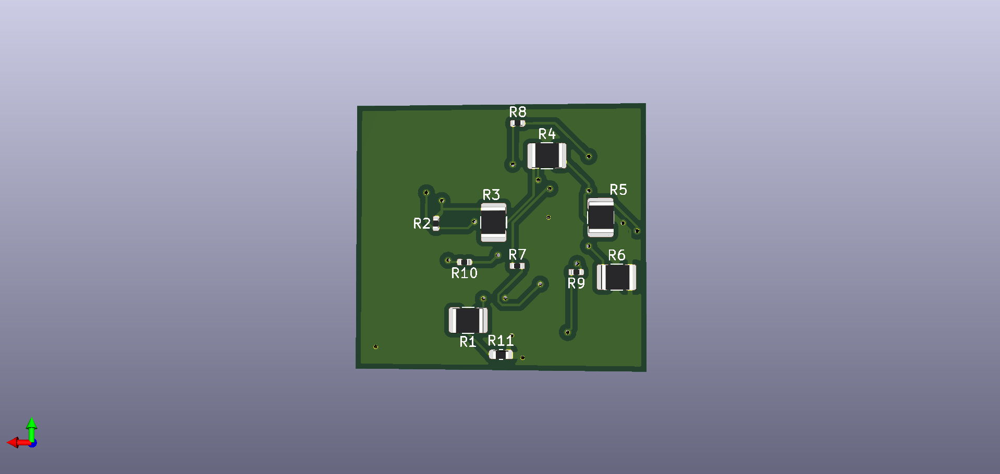

# 🔌 MCP6L94T Analog Comparator Board — BSc PCB Design

> A multi-output LED driver circuit built around the MCP6L94T quad op-amp,
> fully designed in KiCad from schematic to 3D render.

📄 BSc Mechatronics Engineering · V3EE27 · 2020

---

## 📌 Project Overview

This was my first complete PCB design, built as part of my BSc in Mechatronics
Engineering. The goal was to design a functional analog comparator circuit using
the MCP6L94T op-amp, route it on a real PCB, and produce a manufacturable board
file — handling the full workflow from schematic capture to Gerber export and
3D verification.

The circuit uses four comparator channels to drive individual LEDs, powered by a
9V battery with a push-to-test function for manual verification.

---

## ⚙️ Circuit Overview

| Property | Value |
|---|---|
| Core IC | MCP6L94T-E/SL — Quad Op-Amp (SOP-14) |
| Supply | 9V DC battery (BT1) |
| Outputs | 4× LED indicators with 3.3kΩ current limiters |
| Input resistors | 1kΩ / 3.3kΩ voltage divider network |
| Bypass capacitor | 0.1µF (C1) on VDD |
| Test function | Push-to-test button (push1) |
| EDA Tool | KiCad 6.1.5 |

---

## 🖼 Board Preview

### Front Side (F.Cu)


### Back Side (B.Cu)


### 3D Render — Front


### 3D Render — Back


---

## 🛠 Design Workflow

1. **Schematic capture** — all components placed and connected in KiCad Schematic Editor
2. **PCB layout** — manual trace routing, component placement optimized for signal flow
3. **Gerber export** — full layer set exported for fabrication readiness
4. **3D render** — front and back verification before finalization
5. **Design review** — identified and corrected placement issues caught only in 3D view

---

## 📁 Repository Structure

```
mcp6l94t-comparator-pcb/
│
├── schematic/
│   ├── schematic.sch       # KiCad schematic source
│   └── schematic.pdf       # Exported PDF — viewable without KiCad
│
├── pcb/
│   └── board.kicad_pcb     # PCB layout file
│
├── gerbers/
│   ├── F_Cu.gbr
│   ├── B_Cu.gbr
│   ├── F_Mask.gbr
│   ├── B_Mask.gbr
│   ├── F_Paste.gbr
│   ├── B_Paste.gbr
│   ├── F_SilkS.gbr
│   ├── B_SilkS.gbr
│   └── Edge_Cuts.gbr
│
├── renders/
│   ├── pcb_front.png       # F.Cu layer view
│   ├── pcb_back.png        # B.Cu layer view
│   ├── 3d_front.png        # 3D render — front side
│   └── 3d_back.png         # 3D render — back side
│
├── mcp6l94t-comparator-pcb.pro              # KiCad project file
└── README.md
```

---

## 💡 Key Learnings

- **3D rendering is not optional** — caught placement conflicts completely invisible in 2D layout
- **Ground planes matter** — routing without a solid copper fill creates unnecessary noise risk; first thing I'd fix in a redesign
- **SMD footprint sizing** — learned to balance component size against manual solderability

---

## 🔮 What I'd Do Differently Today

- Add a copper fill ground plane on both layers
- Tighten trace routing around the IC — reduce stub lengths
- Add test points on each comparator output for easier probing
- Use a regulated 5V supply instead of raw 9V battery

---

## 👤 Author

**Danial Maktabi**
BSc Mechatronics Engineering | MSc Data Analytics

[](https://www.linkedin.com/in/danial-maktabi)
[](https://github.com/danial-maktabi)

---

## 📄 License

Open hardware — feel free to reference or adapt with attribution.
